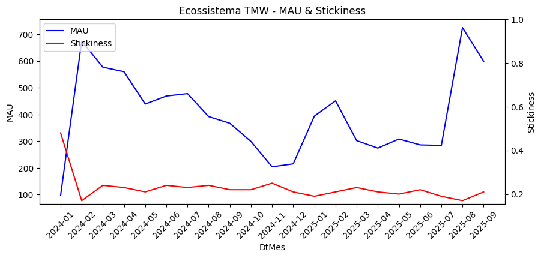
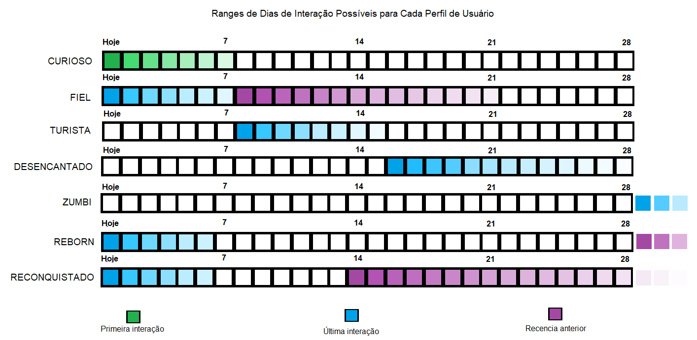

# Loyalty Predict

Construindo uma solução de Data Science de predição de tendencia da comunidade TMW! Confira todo o material em [cursos.teomewhy.org](cursos.teomewhy.org).

# Índice

- [Objetivo](#objetivo)
- [Ações](#ações)
- [Pré Requisitos](#pré-requisitos)
- [Etapas](#etapas)
- [Fonte de Dados](#fontes-de-dados)
- [Como nos apoiar](#apoie-o-nosso-trabalho)
- [Perguntas Frequentes](#perguntas-frequentes)

## Objetivo

O plano atende à proposta de elevar a capacidade de escalabilidade e visibilidade da comunidade, mediante os dados de engajamento nesses portais de forma transacional. O objetivo engloba também identificar perda ou ganho de engajamento dos usuários da comunidade. No escopo, o produto final apresenta uma solução em API de predição de fidelidade para a próxima janela temporal estabelecida no projeto.

## Ações

- Métricas gerais do TMW;
- Definição do Ciclo de Vida dos usuários;
- Análise de Agrupamento dos diferentes perfís de usuários;
- Criar modelo de Machine Learning que detecte a perda ou ganho de engajamento;
<!-- - Incentivo por meio de pontos para usuários mais engajados; -->

## Pré Requisitos

Confira as ferramentas necessárias para estar confortável em replicar o projeto. Você pode aprender todas elas no  YouTube de maneira 100% gratuita:

- [SQL](https://www.youtube.com/playlist?list=PLvlkVRRKOYFRo651oD0JptVqfQGDvMi3j)
- [Python](https://www.youtube.com/playlist?list=PLvlkVRRKOYFSpRkqnR0p2A-eaVlpLnN3D)
- [Pandas](https://www.youtube.com/playlist?list=PLvlkVRRKOYFQHnDhjTmXLEz3HU5WTgOcF)
- [Estatística](https://www.youtube.com/playlist?list=PLvlkVRRKOYFQGIZdz7BycJet9OncyXlbq)
- [Machine Learning](https://www.youtube.com/playlist?list=PLvlkVRRKOYFR6_LmNcJliicNan2TYeFO2)
- [Git e GitHub](https://www.youtube.com/playlist?list=PLvlkVRRKOYFQyKmdrassLNxkzSMM6tcSL)

## Fontes de Dados

- [Sistema de Pontos](https://www.kaggle.com/datasets/teocalvo/teomewhy-loyalty-system)
- [Plataforma de Cursos](https://www.kaggle.com/datasets/teocalvo/teomewhy-education-platform)

## Etapas

### Entendimento do negócio

TeoMeWhy é uma comunidade online criada por [Teo Calvo](https://www.linkedin.com/in/teocalvo/), com o intuito de democratizar o conhecimento em Data Science, Data Engineering e Analytics de forma gratuita e facilitada. A comunidade atualmente possui três frentes de participação e engajamento de público:
- **Canal na Twitch:** são realizadas diariamente lives de conteúdos livres realacionados a área de dados ou desenvolvimento de software, além de cursos agendados dentro do tema. A participação de público é percebida pelas interações via chat e pela participação no [sistema de pontos](https://teomewhy.org/twitch#sistema-de-pontos) da comunidade.
- **Canal no Youtube:** são publicados conteúdos relacionados a temas importantes discutidos nas lives, além de todo o conteúdo didático dos cursos transmitidos na Twitch.
- **Plataforma Educacional:** portal de gestão da trilha de aprendizado dos usuários, possuindo integração com a conta da Twitch e com o Youtube.

### Extração dos dados

Os dados utilizados em toda a parte analítica e preditiva deste projeto estão disponíveis na plataforma Kaggle. É possivel extrai-los de forma manual, indo até o portal e efetuando download das bases, ou utilizando a API do Kaggle com uma chave de acesso vinculada a uma conta. Os dados presentes nos repositórios do Kaggle sofrem atualização do ecossistema TMW a cada 6h.
A utilização dessas bases de dados dentro do projeto se dá via SQLite. Nesse caso foi utilizado o plugin SQLite do VsCode.

### Entendimento dos dados
Ambas as bases de dados compoem a população de membros e estudantes que interagem ou utilizam as frentes de trabalho da comunidade TeoMeWhy. São elas:
- **Loyalty System:** banco de dados referente às transações interativas que ocorrem no chat do canal TeoMeWhy na Twitch. Os usuários, aqui armazenados na tabela `clientes.csv`, realizam interações registradas na tabela `transacoes.csv` relacionadas à comentários, ações interativas ou trocas dos sistemas de pontos que estão especificados em `produtos.csv` e devidamente registrados por usuários em `transação_produto.csv`.
- **Education Platform:** banco responsável por armazenar informações sobre a plataforma de cursos da comunidade TMW. Os usuários cadastrados em `usuarios_tmw.csv` são registrados conforme seu cadastro na plataforma, tendo a opção de vincularem seu usuário da Twitch com a plataforma educacional. Nela, são registrados os cursos assistidos com episódios completos (`cursos.csv`, `cursos_episodios.csv`, `cursos_episodios_completos.csv`), além das habilidades relacionadas a cada cargo escolhido no PDI (Plano de Desenvolvimento Individual) da plataforma (`habilidades.csv`, `habilidades_cargos.csv`, `habilidades_usuarios.csv`). Os usuários também registram recompensas que são integradas ao sistema de pontos da comunidade quando completam aulas na plataforma em `recompensas_usuarios.csv`.

 

### Métricas gerais e Analise de Usuários do TMW

A comunidade TMW possui uma base de acompanhantes e membros em constante movimento, pois conta com divulgação constante nas redes sociais da própria comundiade e dos que a acompanha. Essa divulgação é responsável também por espalhar a agenda programada de cursos e projetos realizados pelo Téo ao vivo na Twitch.   

Neste projeto, o comportamento a ser observado é o de retenção. A partir do MAU (Monthly Active Users) da plataforma dentro do intervalo da base, é possível observar um comportamento decrescente, que acaba oscilando em períodos notáveis do calendário da comunidade. Ao mesmo tempo é notável uma taxa de aderência (Stickiness) que se apresenta com baixa oscilação, mas em uma porcentagem baixa, contrastando em pontos onde a quantiade de usuários ativos apresenta picos. Esses pontos coincidem por exemplo com cursos de alta popularidade dentro do calendário do TMW, como por exemplo o curso de SQL (Agosto/2025) que teve grande interesse durante seu período inicial de execução.

### Perfilamento com Base na Recência dos Usuários

Com essas noções de comportamento, um mapeamento de usuários pode ajudar a entender os padrôes que representam as recências dos usuários na base. Visto que o trabalho de análise é em cima dos usuários ativos mensalmente, a adoção da janela mensal se faz necessária, contudo, é preciso considerar o viés de sazonalidade que pode existir na diferença de dias entre meses e disposição de calendário. Pensando nisso, a adoção de observação temporal se dá usando 28 dias. A rotulagem de perfil dos usuários acontece em marcos dentro da janela:

<!-- | USUÁRIO | Regras |
| :--- | :--- |
| Curioso | `tempo desde primeiro dia <= 7` |
| Fiel | `tempo desde ultimo dia <= 7` **e** `recencia < 15` |
| Turista | `7 <= tempo desde ultimo dia <= 14` |
| Desencantado | `tempo desde ultimo dia <= 28` |
| Zumbi | `tempo desde ultimo dia > 28` |
| Reborn | `tempo desde ultimo dia < 7` **e** `recencia > 28` |
| Reconquistado | `tempo desde ultimo dia < 7` **e** `14 <= recencia <= 28` | -->

Aqui, foram usados 3 dados de registro de usuários baseado em histórico que pode fortalecer a observação e a definição de perfis usando uma data referência:
- **Primeira Interação:** Tempo desde a primeira vez que o usuário interagiu na live
- **Última Interação:** O tempo desde a última interação na plataforma
- **Recência Anterior:** O tempo desde a penúltima interação e a ultima interação

Tomando a última interação como medidor de atividade, é possivel adotar o ciclo de vida do usuário baseado nela. Se assumido que a primeira interação também funciona como última interação, o caminho de um usuário dentro da plataforma se inicia em Curioso, e pode formar um ciclo quando (ou se) Reconquistado, conforme a janela vai avançando.

🚧 README EM CONSTRUÇÃO 🚧

<!-- ### Treinamento e registro do modelo no MLFlow; -->
<!-- ### Criação de App para Inferência em Tempo Real;
### Integração com Ecossistema TMW; --> 

## Apoie o trabalho do TeoMeWhy

- 💵 Chave Pix: pix@teomewhy.org
- 💶 LivePix: [livepix.gg/teomewhy](https://livepix.gg/teomewhy)
- 💷 GitHub Sponsors: [github.com/sponsors/TeoMeWhy](https://github.com/sponsors/TeoMeWhy)
- 💴 ApoiaSe: [apoia.se/teomewhy](https://apoia.se/teomewhy)
- 🎥 Membro no YouTube: [youtube.com/@teomewhy/membership](https://youtube.com/@teomewhy/membership)
- 🎮 Sub na Twitch: [twitch.tv/teomewhy](https://twitch.tv/teomewhy)
- 💌 Newsletter: [teomewhy.substack.com](https://teomewhy.substack.com)
- 📚 Lojinha na Amazon: [Clique Aqui](https://www.amazon.com.br/shop/teo.calvo?-ref_=cm_sw_r_cp_ud_aipsfshop_MS3WV3HX76NT92FNB5BC)

## Informações relevantes

> [!IMPORTANT]
> A comunidade TeoMeWhy tem lives diariamente de segunda a sexta-feira, a partir das 9h, onde esse e outros projetos de Data Science são desenvolvidos em grupo. Basta acessar o canal [twitch.tv/teomewhy](https://twitch.tv/teomewhy) no horário e assistir.

> [!TIP]
> O curso completo da criação deste projeto está disponível no canal do TeoMeWhy para [membros no YouTube](https://www.youtube.com/channel/UC-Xa9J9-B4jBOoBNIHkMMKA/join).

